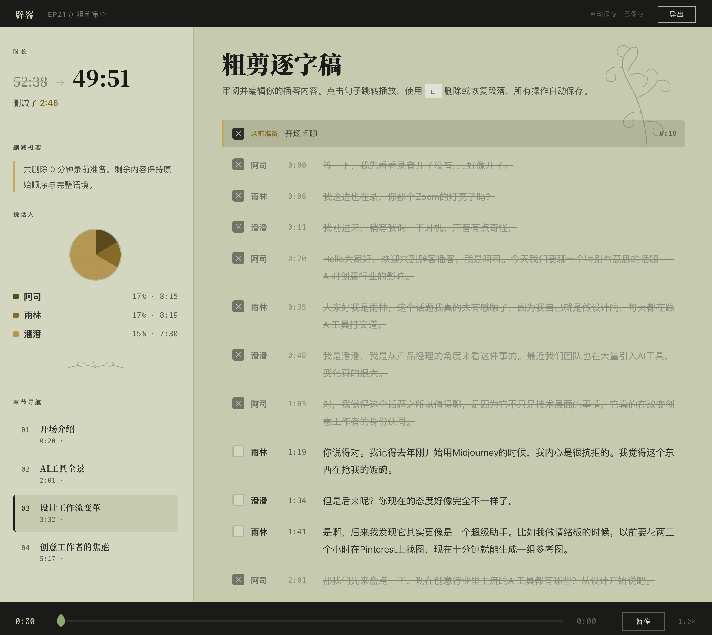

# Podcastcut

一个用 Claude Code Skills 做的播客剪辑助手。丢进去一段原始录音，它帮你转录、分析、标记该删的内容，然后你在浏览器里审一遍，导出，完事。

本项目 fork 自 [@luoyuweidu1](https://github.com/luoyuweidu1) 的 [podcastcut-skills](https://github.com/luoyuweidu1/podcastcut-skills)，在她的核心架构上做了一轮迭代。

---

## 审查页面

这是 V7 版本最大的改动——粗剪完成后，你会在浏览器里看到这个页面：



左侧是控制面板：时长对比、删减摘要、说话人分布饼图、章节导航。右侧是完整逐字稿，被 AI 标记删除的段落会变灰并划线。点击任意句子会自动播放对应位置的音频。

你可以勾选恢复任何被误删的段落，也可以手动标记新的删除。所有编辑自动保存，不用担心丢失。审完之后点「导出」，拿着文件去跑剪辑脚本就行。

---

## 我改了什么，以及为什么

原版已经很完整了——阿里云转录、规则+LLM 混合分析、交互式审查页、三阶段质检，整个流水线都有。我在实际用它剪了几期播客之后，发现了一些可以优化的地方：

**审查页面的音质是压缩过的。** 原版为了浏览器 seek 精度把审查音频压到了 64kbps，听起来很糊。改成了 192kbps——CBR 仍然保证精确跳转，但听感完全不同。这个改动很小，但体验差距很大。

**流程太多步了。** 原版 8 个阶段，有些步骤可以合并。精简成了 5 步：转录分析 → 人工审核 → 剪辑质检 → 音质处理 → 后期。每步的边界更清晰，不容易搞混。

**音质处理没有独立环节。** 用 Zoom 录的播客经常有回声问题，尤其是某个人的麦不好的时候。新增了一个音质处理子技能，可以只对特定说话人的段落做降噪，不影响其他人。而且会自动检测音乐段并跳过，避免 DeepFilterNet 把片头曲吃掉（这个坑我踩过）。

**审查页面信息太密集。** 原版审查页面功能很全但视觉上比较拥挤。重新设计了 UI：侧边栏放控制面板，主区域只放逐字稿，字体放大，删减类型用金色标签而不是多种颜色。整体参考了编辑式排版的风格。

**脚本里有硬编码路径。** 原版的一些脚本写死了作者本地的路径，换台电脑就跑不了。改成了自动检测项目根目录。

---

## 5 步流水线

```
阶段 1  转录 + AI 分析（全自动）
        阿里云 FunASR 转录 → 说话人识别 → 粗剪分析 → 精剪分析 → AI 自审查

阶段 2  人工审核
        浏览器打开审查页面 → 审阅逐字稿 → 删除/恢复段落 → 导出

阶段 3  剪辑执行 + 质检
        采样级精确剪辑（≥192kbps）→ 静音裁剪 → 可选质检

阶段 4  音质处理（新增）
        按说话人降噪/去回声 → 音乐段保护 → 响度标准化（-16 LUFS）

阶段 5  后期
        高光片段提取 → 片头片尾音乐 → 时间戳章节 → 标题/简介
```

## 安装

```bash
# 1. Clone
git clone https://github.com/chenyusi/podcastcut-skills.git
cd podcastcut-skills

# 2. 注册 Claude Code Skills
PODCASTCUT_DIR="$(pwd)"
mkdir -p ~/.claude/skills
ln -s "$PODCASTCUT_DIR/安装"      ~/.claude/skills/podcastcut-安装
ln -s "$PODCASTCUT_DIR/剪播客"    ~/.claude/skills/podcastcut-剪播客
ln -s "$PODCASTCUT_DIR/后期"      ~/.claude/skills/podcastcut-后期
ln -s "$PODCASTCUT_DIR/质检"      ~/.claude/skills/podcastcut-质检
ln -s "$PODCASTCUT_DIR/音质处理"  ~/.claude/skills/podcastcut-音质处理

# 3. 安装依赖
brew install node ffmpeg

# 4. 配置阿里云 API Key
cp .env.example .env
# 编辑 .env，填入 DashScope API Key
# 获取地址：https://dashscope.console.aliyun.com/
```

然后在 Claude Code 里输入：

```
/podcastcut-剪播客 你的音频文件.mp3
```

详细安装说明见 `/podcastcut-安装`。

## Skill 清单

| Skill | 命令 | 做什么 |
|-------|------|--------|
| 安装 | `/podcastcut-安装` | 环境准备、依赖检查 |
| 剪播客 | `/podcastcut-剪播客` | 主流程：转录→分析→审查→剪辑 |
| 质检 | `/podcastcut-质检` | 数据层+信号层+语义层质检 |
| 音质处理 | `/podcastcut-音质处理` | 按说话人降噪、响度标准化 |
| 后期 | `/podcastcut-后期` | 片头片尾、高光、时间戳 |

## 依赖

| 依赖 | 用途 |
|------|------|
| Node.js | 运行脚本 |
| FFmpeg | 音频处理 |
| Python 3 | 音频剪辑 |
| 阿里云 DashScope API | 语音转录 |

音质处理子技能额外需要：`pip install deepfilternet pyloudnorm librosa soundfile`

## 致谢

感谢 [@luoyuweidu1](https://github.com/luoyuweidu1) 创建了 podcastcut-skills。核心架构——阿里云 FunASR 转录、规则+LLM 混合精剪、交互式审查页面、三阶段质检——都是她的工作。本项目在此基础上做了工作流优化、UI 重设计和功能扩展。

## License

MIT
